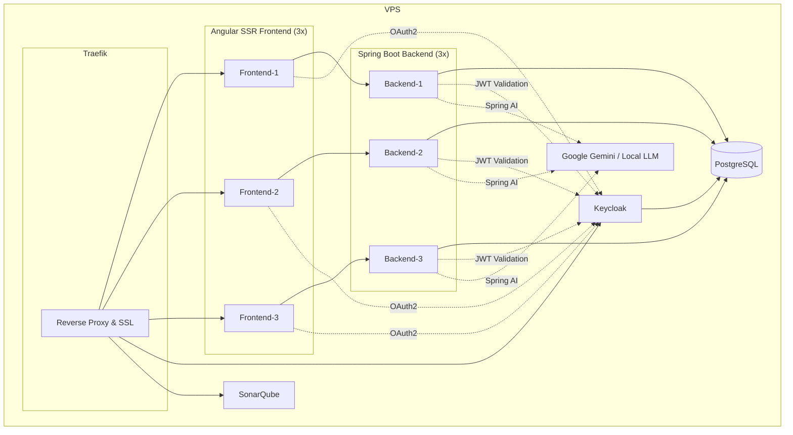

# mkopp.dev - A Portfolio in Action

[](https://github.com/MichaelJGKopp/mkopp.dev/actions/workflows/deploy.yml)
[](./LICENSE)

This repository contains the source code for **mkopp.dev**. Unlike a traditional portfolio that links to external projects, this project follows a "show, don't just tell" philosophy: **the website itself is the portfolio.**

It is designed to be a living, breathing showcase of enterprise-level full-stack engineering, real-world DevOps practices, and transparent design decisions.

## Core Philosophy

- **The Project is the Product:** The primary goal is to demonstrate skills in architecture, development, and deployment through the platform itself.
- **Radical Transparency:** All design documents, architectural decisions (ADRs), and project planning are public.
- **A Learning Resource:** The platform serves as a teaching tool through blog posts and documentation that explain how it was built.

---

## Tech Stack

This project is a full-stack application built within an **Nx monorepo**.

| Category                   | Technology                                                                                                       |
| -------------------------- | ---------------------------------------------------------------------------------------------------------------- |
| **Frontend**               | [Angular 20](https://angular.io/) with SSR, [TailwindCSS](https://tailwindcss.com/), [DaisyUI](https://daisyui.com/) |
| **Backend**                | [Spring Boot 3.5](https://spring.io/projects/spring-boot) (Java 17), [Spring Modulith](https://spring.io/projects/spring-modulith) |
| **AI/ML**                  | [Spring AI 1.1](https://spring.io/projects/spring-ai), [Google Gemini](https://ai.google.dev/), OpenAI, PGVector |
| **Database**               | [PostgreSQL 16](https://www.postgresql.org/) with [Flyway](https://flywaydb.org/) migrations                    |
| **Authentication**         | [Keycloak 24](https://www.keycloak.org/) (OAuth2/OIDC + Social Login)                                           |
| **Content**                | [ngx-markdown](https://github.com/jfcere/ngx-markdown), [highlight.js](https://highlightjs.org/)                |
| **API Contract**           | [OpenAPI 3.1](https://www.openapis.org/) with [OpenAPI Generator](https://openapi-generator.tech/)              |
| **Quality**                | [SonarQube](https://www.sonarsource.com/products/sonarqube/), OWASP, Snyk                                       |
| **DevOps**                 | [Docker](https://www.docker.com/), [Docker Compose](https://docs.docker.com/compose/), [GitHub Actions](https://github.com/features/actions), [Traefik 3](https://traefik.io/) |
| **Monorepo**               | [Nx 21](https://nx.dev/)                                                                                         |
| **Monitoring (Planned)**   | Grafana, Loki, Prometheus, Tempo observability stack                                                             |
| **Caching (Planned)**      | Distributed Redis cache, rate limiting (Traefik + backend), idempotent keys                                      |

---

## Architecture Overview

The system is deployed on a single VPS and orchestrated with Docker Compose. Traefik acts as a reverse proxy, handling SSL and routing requests to a cluster of redundant frontend and backend services.



For a full rationale and implementation details, see **[ADR 004 – Deployment with Docker + Traefik](./docs/adr/0004-deployment-with-docker-and-traefik.md)**.

---

## Key Features

### 🤖 AI-Powered Chatbot (preliminary)

- **Spring AI Integration**: Supports Google Gemini, OpenAI, and local LLM models
- **Conversation Memory**: In-memory chat history with conversation ID management
- **System Prompts & Guardrails**: Portfolio assistant and blog post generator with safety controls
- **Streaming Responses**: Real-time streaming and traditional response modes
- **Tool Usage**: Extensible function calling (DateTimeTools example)
- **Future RAG**: Skeleton for vectorized codebase and documentation search

### 📝 Full-Featured Blog System

- **Markdown Rendering**: Rich content with `ngx-markdown` and syntax highlighting via `highlight.js`
- **Theme Support**: Light and dark modes for code blocks
- **Comments System**: Nested comments with threaded replies and pagination
- **Likes**: Like functionality for both blog posts and comments
- **SSR Optimized**: Blog posts loaded server-side for SEO and performance
- **Database-Driven**: PostgreSQL storage with automated Flyway migrations from Markdown source

### 🎨 Modern Frontend

- **Fully Responsive**: Optimized layouts for mobile, tablet, and desktop
- **No Theme Flash**: Early JavaScript theme loading prevents visual flicker
- **Scroll Restoration**: Persists scroll position across navigation and authentication
- **Type-Safe API Client**: Auto-generated from OpenAPI contract with TypeScript types
- **TailwindCSS + DaisyUI**: Utility-first styling with component library and Prettier plugin for class ordering
- **Icons**: FontAwesome (brands, regular, solid), DaisyUI icons, direct SVG

### 🔒 Enterprise Security

- **OAuth2/OIDC**: Keycloak integration with PKCE flow and social login (Google)
- **JWT Validation**: Backend validates access tokens
- **Role-Based Access**: Admin and user roles with route guards
- **Token Refresh**: Automatic token renewal
- **User Registration**: Email validation via SMTP with password strength requirements

### 🛠 Development Excellence

- **Code Quality**: SonarQube integration for static analysis
- **Security Scanning**: OWASP and Snyk for vulnerability detection
- **API-First**: OpenAPI 3.1 contract drives type-safe client generation
- **Database Migrations**: Flyway for versioned schema evolution
- **Monorepo**: Nx workspace with integrated tooling

---

## Local Development

### Prerequisites

- **Docker & Docker Compose**
- **Java 17**: The backend is a Spring Boot application which requires Java 17.
- **Node.js v22.2.0+**: The frontend is an Angular application.
- **npm 10.8.0+**: Package manager for the frontend.
- **An IDE** (e.g., VS Code, IntelliJ IDEA)

### Setup

1. **Clone the repository:**

    ```sh
    git clone https://github.com/MichaelJGKopp/mkopp.dev.git
    cd mkopp.dev
    ```

2. **Configure Environment Variables:**
    - Copy the example environment file:

        ```sh
        cp .env.example .env
        ```

    - Open the new `.env` file and replace the placeholder values with your local configuration.

3. **Launch the Application:**
    - Use Docker Compose to build and run all the services:

        ```sh
        docker-compose -f docker/docker-compose.yml --env-file .env up --build
        ```

4. **Access the Application:**
    - Frontend: [http://localhost](http://localhost) (or your configured domain)
    - Traefik Dashboard: [http://traefik.localhost](http://traefik.localhost) (Requires basic auth credentials from your `.env` file).

### Running Tests

You can run the tests for the frontend and backend separately.

- **Frontend (Angular):**

    ```sh
    npx nx test mysite-frontend
    ```

- **Backend (Spring Boot):**

    ```sh
    npx nx test mysite-backend
    ```

---

## Production Deployment

Production deployment uses a separate `docker-compose.prod.yml` file and is automated via a CI/CD pipeline.

### CI/CD Flow

1. **Push to `main` branch:** A push or merge to the `main` branch triggers the [GitHub Actions workflow](https://github.com/MichaelJGKopp/mkopp.dev/actions/workflows/deploy.yml).
2. **Build & Test:** The workflow builds and tests the frontend and backend applications.
3. **Publish Docker Images:** On success, multi-stage Docker images are built and pushed to DockerHub.
4. **Deploy to VPS:** The `deploy.sh` script is executed on the production VPS via SSH. This script pulls the latest images from DockerHub and restarts the services using `docker-compose -f docker-compose.prod.yml up -d`.

This process ensures automated, consistent deployments to the production environment.

---

## Project Structure

This is an Nx monorepo. Key directories include:

- `apps/`: Contains the two main applications:
  - `mysite-frontend/`: The Angular SSR frontend.
  - `mysite-backend/`: The Spring Boot (Java) backend.
- `docs/`: Contains all project documentation, including this README, the [Design Document](./docs/design.md), and [Architecture Decision Records (ADRs)](./docs/adr/).

To visualize the project graph and dependencies, run:

```sh
npx nx graph
```

---

## Contributing

Contributions are welcome! Please see our [Contributing Guidelines](./CONTRIBUTING.md) for more information on how to get started.

---

## Code of Conduct

This project is governed by the [Contributor Covenant Code of Conduct](./CODE_OF_CONDUCT.md). By participating, you are expected to uphold this code.

---

## Development Process

This project follows an agile approach using a [public Kanban board](https://github.com/users/MichaelJGKopp/projects/1/views/1) to track user stories, epics, and progress. For more details, see the [Design Document](./docs/design.md#5-development-process).
