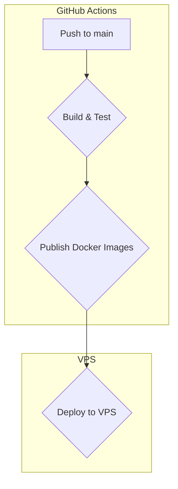

# Our Deployment Pipeline: From `git push` to Production

This post provides a deep dive into the CI/CD and deployment pipeline used for this project. It's designed to be automated, reliable, and to follow industry best practices.

## The Big Picture: A High-Level Overview

Our deployment pipeline is triggered on every push to the `main` branch. It consists of three main stages:

1.  **Build & Test**: The application is built and tested in a clean environment.
2.  **Publish Docker Images**: The frontend and backend applications are packaged into Docker images and pushed to a container registry.
3.  **Deploy to VPS**: The new images are pulled on the production server, and the services are updated.

Here is a visual representation of the pipeline:

## The CI Stage: Building and Pushing with GitHub Actions

The continuous integration part of our pipeline is handled by GitHub Actions. The workflow is defined in `.github/workflows/deploy.yml`.

### Build and Push Jobs

The workflow has two parallel jobs, `build-and-push-frontend` and `build-and-push-backend`, which are responsible for building the Docker images for the frontend and backend respectively.

These jobs perform the following steps:
1.  **Checkout the code**.
2.  **Set up Docker Buildx** for building multi-platform images.
3.  **Log in to Docker Hub** using secrets stored in the repository.
4.  **Extract metadata** such as tags and labels for the Docker images.
5.  **Build and push the Docker image** to Docker Hub. The images are tagged with the short commit SHA for traceability.

### The Deploy Job

Once the images are successfully built and pushed, the `deploy` job is triggered. This job is responsible for updating the services on our production Virtual Private Server (VPS).

It performs the following steps:
1.  **Sets up an SSH agent** with the private key to access the VPS.
2.  **Adds the remote host to `known_hosts`** to avoid interactive prompts.
3.  **Connects to the VPS via SSH and executes the `deploy.sh` script**.

## The Deployment Stage: Updating the Services on the VPS

The `deploy.sh` script on the server orchestrates the update of the running services. It uses `docker-compose` with the `docker/docker-compose.prod.yml` file to manage the services.

Here is the core logic of the script:

1.  **It expects `FRONTEND_TAG` and `BACKEND_TAG` environment variables** to be set by the GitHub Actions workflow.
2.  **It updates the backend service first** using `docker compose ... up -d --force-recreate backend`.
3.  **It waits for 30 seconds** for the backend to stabilize.
4.  **It then updates the frontend service**.
5.  **Finally, it prunes old Docker images** to save disk space.

This backend-first deployment strategy helps to minimize downtime, as the frontend is only updated after the new backend is healthy and ready.

## Infrastructure and Architecture

Our production environment is running on a VPS and is orchestrated using Docker Compose. The key components are:

*   **Traefik**: A modern reverse proxy that handles HTTPS termination and routing to the frontend and backend services.
*   **PostgreSQL**: The database for our backend.
*   **Frontend and Backend services**: Running as Docker containers.

For more details on the architecture and the decisions behind it, you can refer to our [ADR on Deployment with Docker and Traefik](./../docs/adr/0004-deployment-with-docker-and-traefik.md).

## Limitations and Future Improvements

Our current pipeline is robust, but there is always room for improvement. Here are some of the current limitations and potential future enhancements:

*   **No Zero-Downtime Deployment**: The current setup stops the old containers before starting the new ones, which can cause a brief downtime. In the future, we might move to a more advanced orchestration tool like Docker Swarm or Kubernetes to achieve zero-downtime deployments. The `deploy-swarm.sh` script in the repository is a first step in that direction.
*   **Nx Integration**: Currently, Nx is only used to build the frontend. We plan to integrate the backend build process into Nx as well.
*   **Linting and Testing**: We plan to integrate linting and more comprehensive testing into the CI/CD pipeline to improve code quality.

## Conclusion

Our current deployment pipeline provides a solid foundation for developing and deploying our application. It's automated, reliable, and follows modern DevOps practices. It allows us to ship new features and bug fixes to production quickly and safely.
