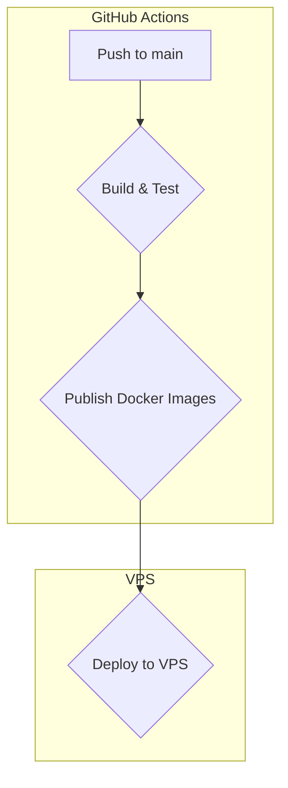

```mermaid
graph TD
    A[Push to main] --> B{Build & Test};
    B --> C{Publish Docker Images};
    C --> D{Deploy to VPS};

    subgraph GitHub Actions
        A
        B
        C
    end

    subgraph VPS
        D
    end

    click A "https://github.com/MichaelJGKopp/mkopp.dev/actions/workflows/deploy.yml" "View GitHub Actions"
```
