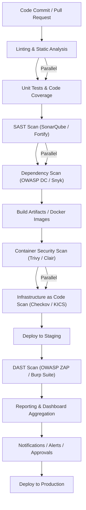

# Enterprise CI/CD Pipeline

```mermaid
flowchart TD
    A["Code Commit / Pull Request"] --> B["Linting & Static Analysis"]
    B --> C["Unit Tests & Code Coverage"]
    C --> D["SAST Scan (SonarQube / Fortify)"]
    D --> E["Dependency Scan (OWASP DC / Snyk)"]
    E --> F["Build Artifacts / Docker Images"]
    F --> G["Container Security Scan (Trivy / Clair)"]
    G --> H["Infrastructure as Code Scan (Checkov / KICS)"]
    H --> I["Deploy to Staging"]
    I --> J["DAST Scan (OWASP ZAP / Burp Suite)"]
    J --> K["Reporting & Dashboard Aggregation"]
    K --> L["Notifications / Alerts / Approvals"]
    L --> M["Deploy to Production"]

    %% Optional parallelization
    B -->|Parallel| C
    D -->|Parallel| E
    G -->|Parallel| H

```
