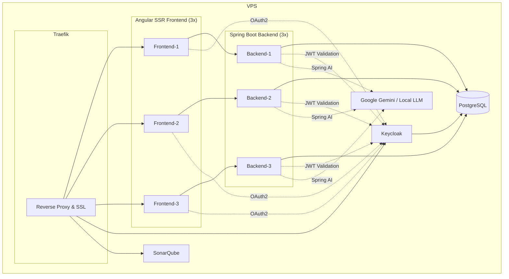

# mkopp.dev – Design Document (v0.4)

## Version History

| Version | Date       | Changes / Summary                                                                                                             | Related ADRs                                                                                                               |
| ------- | ---------- | ----------------------------------------------------------------------------------------------------------------------------- | -------------------------------------------------------------------------------------------------------------------------- |
| v0.1    | 2025-09-10 | Initial outline: project goals, tech stack, basic architecture                                                                | —                                                                                                                          |
| v0.2    | 2025-09-14 | Full monorepo setup with Nx (Angular SSR frontend + Spring Boot backend), CI/CD pipeline with Docker, Traefik, VPS deployment | ADR 002 – Nx Monorepo with Feature-Based Modularity ADR 003 – SSR Angular ADR 004 – Deployment with Docker + Traefik |
| v0.3    | 2025-11-01 | Keycloak OAuth2/OIDC integration fully implemented (frontend + backend), role-based access control                            | ADR 001 – Authentication with Keycloak                                                                           |
| v0.4    | 2025-12-04 | AI chatbot, blog system with comments/likes, Markdown rendering, theme system, OpenAPI code generation, SonarQube integration | ADR 006 – Flyway, ADR 007 – Keycloak JS                                                                          |
| v0.5    | TBD        | Planned: vectorized RAG (codebase + documentation), persistent chat memory in DB, enhanced AI capabilities                    | —                                                                                                                          |

---

## 1. Project Overview

**mkopp.dev** is a personal fullstack platform designed to:

* Serve as a **showcase of itself**: architecture, deployment, DevOps practices.
* Provide **documentation and transparency** on how it was built.
* Act as a **teaching and learning resource** through blog posts, mostly about the project itself.

Unlike traditional portfolios that showcase many external projects, **mkopp.dev is the project**.

---

## 2. Goals

* Demonstrate **enterprise-level fullstack engineering** skills.
* Showcase **real-world DevOps pipeline** (CI/CD, Docker, Traefik, VPS deployment).
* Document **design and architectural decisions** publicly (ADRs, blog posts).
* Build a platform that is **open-source and iterative**, with visible planning (Kanban/issues).

---

## 3. Technology Stack

### Frontend

* **Framework**: Angular 20.1 with Server-Side Rendering (SSR)
* **UI Components**: Custom components with TailwindCSS
* **State Management**: Angular Signals for reactive state
* **Markdown**: ngx-markdown 20.1.0 with highlight.js 11.11.1 for syntax highlighting
* **Icons**: FontAwesome (brands, regular, solid)
* **Build Tools**: Nx 21.4.1 monorepo tooling
* **Code Generation**: OpenAPI Generator CLI 2.25.2 for type-safe API clients
* **Styling**: TailwindCSS with Prettier plugin for class ordering

### Backend

* **Framework**: Spring Boot 3.5.5 (Java 17)
* **Architecture**: Spring Modulith 1.4.1 for modular monolith design
* **AI Integration**: Spring AI 1.1.0
  * Google Gemini AI model support
  * OpenAI model support  
  * PGVector for vector storage
  * RAG (Retrieval Augmented Generation) capabilities
  * System prompt instructions and guardrails
* **Security**: Spring Security with OAuth2 Resource Server + Social Login (Google)
* **Database**:
  * PostgreSQL 16 with PGVector extension
  * Flyway for database migrations
* **API Documentation**: OpenAPI 3.1 with Springdoc
* **Object Mapping**: MapStruct 1.6.3

### DevOps & Quality

* **CI/CD**: GitHub Actions
* **Containerization**: Docker with multi-stage builds
* **Orchestration**: Docker Compose (dev), planned Kubernetes (prod)
* **Reverse Proxy**: Traefik 3.5 with automatic SSL
* **Code Quality**: SonarQube
* **Security Scanning**: OWASP Dependency-Check, Snyk (local)
* **Version Control**: Git with GitHub

### Infrastructure

* **Hosting**: VPS (Virtual Private Server)
* **Database**: PostgreSQL 16.10-alpine
* **Authentication**: Keycloak 24.0.4
* **SSL/TLS**: Let's Encrypt via Traefik
* **Monitoring**: Traefik Dashboard with Basic Auth

---

## 4. Features

### Implemented

* **SSR Angular frontend** for SEO.
* **Spring Boot backend** with REST APIs.
* **PostgreSQL database**.
* **Deployment pipeline**:

  * GitHub Actions → build & push multi-stage Docker images to DockerHub.
  * VPS auto-deploy via SSH pull + restart.
  * Docker Compose with Traefik, 3x frontend + 3x backend + Postgres.
  * HTTPS/SSL + email forwarding for domain.

* **Authentication via Keycloak**:
  * OAuth2/OpenID Connect integration
  * Frontend: `keycloak-js` library with custom `Oauth2AuthService`
  * Backend: Spring Security with OAuth2 Resource Server
  * Features: login/logout, token refresh, role-based access control, account management

* **AI-Powered Chatbot**:
  * Spring AI 1.1.0 integration with multiple LLM providers (Google Gemini, OpenAI, local LLM support)
  * In-memory chat conversation history with conversation ID management
  * System prompting with guardrails (portfolio assistant, blog post generator)
  * Preliminary tool usage (DateTimeTools)
  * Streaming and non-streaming response modes
  * Skeleton implementations for: RAG (vector store with embeddings), image-to-text, structured output
  * Fully responsive chat UI optimized for desktop and mobile

* **Blog System**:
  * Full CRUD operations for blog posts (create, read, update, delete)
  * PostgreSQL storage with Flyway database migrations
  * Automated SQL migration generation from Markdown blog posts
  * SSR-optimized: blog posts retrieved server-side from database
  * Markdown rendering with `ngx-markdown` and `highlight.js` for code syntax highlighting
  * Light/dark theme support for code blocks
  * Comment system: nested comments, threaded replies, pagination
  * Like system: for both blog posts and comments
  * Tag-based filtering and categorization

* **Frontend Features**:
  * Fully responsive design across mobile, tablet, and desktop
  * Theme system with no flash on reload (early JavaScript theme loading in `index.html`)
  * Theme persistence in localStorage
  * Scroll position storage and restoration across navigation
  * Type-safe API client generation with OpenAPI Generator CLI
  * TailwindCSS + DaisyUI component library
  * Prettier plugin for Tailwind class ordering

* **User Management**:
  * User registration with email validation via SMTP
  * Password strength requirements and validation
  * Notifications for blog comments and replies

* **Development & Quality Tools**:
  * SonarQube server integration for code quality and static analysis
  * Local vulnerability scanners: OWASP Dependency-Check and Snyk (documented for future CI/CD integration)
  * Automated API contract generation and client code generation

### Planned Features

* **AI Enhancements**:
  * Fully vectorized repository as AI advisor (RAG implementation)
  * Vectorized documentation for Spring Boot and other technologies
  * Persistent chat memory moved to PostgreSQL database
  * Advanced tool usage and function calling
  * Multi-modal capabilities (image analysis, structured output)

* **Infrastructure & Performance**:
  * Grafana + Loki + Prometheus + Tempo observability stack
  * Distributed Redis cache for improved performance
  * Rate limiting (Traefik-level and backend-level)
  * Idempotent key handling for safe retries

* Admin dashboard for managing content (Keycloak-protected).
* Publicly available Kanban/issue tracker integrated into the site.
* Interactive architecture diagrams and deployment visualizations.

---

## 5. Architecture

### Current Setup

### Deployment Flow

1. Push to GitHub → triggers GitHub Actions.
2. Build + test → build multi-stage Docker images.
3. Push images to DockerHub.
4. VPS auto-pulls + redeploys containers with Docker Compose.

**See [ADR 004 – Deployment with Docker + Traefik](./adr/0004-deployment-with-docker-traefik.md) for full rationale and implementation details.**

---

## 6. Development Process

### Agile Approach

* **Kanban board** (GitHub Projects or Jira) → public and linked from site.
* **User stories** mostly centered on:

  * Site visitors (recruiters, learners).
  * Site maintainers (admin).
* **Epics**:

  1. Blog & Documentation System.
  2. Authentication & Admin Panel.
  3. Showcase Integration (Kanban, ADRs, pipeline visualizations).
  4. Infrastructure & Deployment Hardening.

### Example User Stories

* *As a recruiter, I want to read about the architecture decisions, so I can assess the developer’s technical thinking.*
* *As a visitor, I want to see how the CI/CD pipeline works, so I understand the deployment practices.*
* *As an admin, I want to log in with Keycloak and create new blog posts, so I can publish updates easily.*

---

## 7. Documentation & Showcase

* `/docs/` folder contains:

  * `design.md` (this document).
  * ADRs (architecture decision records).
  * Diagrams (Mermaid or PlantUML).
* **Blog posts** serve as extended documentation.
* **Kanban board/issues** linked from the site.
* **Behind the scenes section** → interactive explanation of deployment pipeline.

---

## 8. Non-Functional Requirements

* **SEO**: Angular SSR for search discoverability.
* **Resilience**: Multiple frontend & backend instances behind Traefik.
* **Security**: Hardened VPS, Keycloak OAuth2/OIDC authentication, SSL/TLS.
* **Transparency**: Public repo, public docs, public process.
* **Performance**: Optimized SSR build & caching.

---

## 9. Roadmap

For a detailed project roadmap, please see the [Roadmap](./roadmap.md) document.
