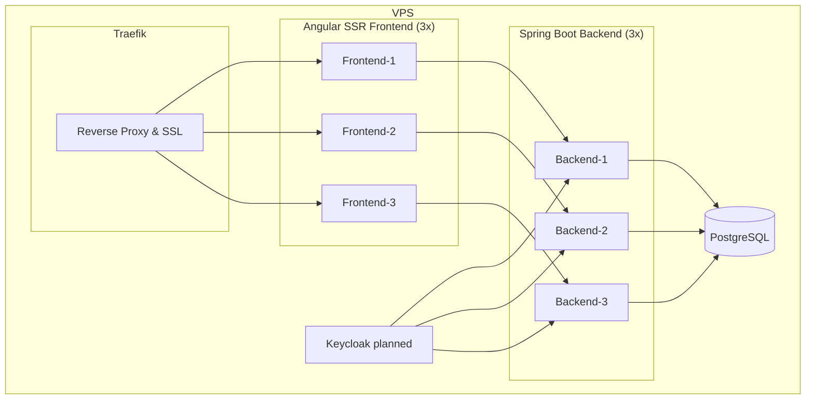

# mkopp.dev – Design Document (v0.2)

## Version History

| Version | Date       | Changes / Summary                                                                                                             | Related ADRs                                                                                                               |
| ------- | ---------- | ----------------------------------------------------------------------------------------------------------------------------- | -------------------------------------------------------------------------------------------------------------------------- |
| v0.1    | 2025-09-10 | Initial outline: project goals, tech stack, basic architecture                                                                | —                                                                                                                          |
| v0.2    | 2025-09-14 | Full monorepo setup with Nx (Angular SSR frontend + Spring Boot backend), CI/CD pipeline with Docker, Traefik, VPS deployment | ADR 002 – Nx Monorepo with Feature-Based Modularity ADR 003 – SSR Angular ADR 004 – Deployment with Docker + Traefik |
| v0.3    | TBD        | Planned: integrate Keycloak for authentication and roles, admin panel, blog system                                            | ADR 001 – Authentication with Keycloak (planned)                                                                           |
| v0.4    | TBD        | Planned: enhanced documentation, ADR indexing, teaching resources                                                             | —                                                                                                                          |

---

## 1. Project Overview

**mkopp.dev** is a personal fullstack platform designed to:

* Serve as a **showcase of itself**: architecture, deployment, DevOps practices.
* Provide **documentation and transparency** on how it was built.
* Act as a **teaching and learning resource** through blog posts, mostly about the project itself.

Unlike traditional portfolios that showcase many external projects, **mkopp.dev is the project**.

---

## 2. Goals

* Demonstrate **enterprise-level fullstack engineering** skills.
* Showcase **real-world DevOps pipeline** (CI/CD, Docker, Traefik, VPS deployment).
* Document **design and architectural decisions** publicly (ADRs, blog posts).
* Build a platform that is **open-source and iterative**, with visible planning (Kanban/issues).

---

## 3. Features

### Implemented

* **SSR Angular frontend** for SEO.
* **Spring Boot backend** with REST APIs.
* **PostgreSQL database**.
* **Deployment pipeline**:

  * GitHub Actions → build & push multi-stage Docker images to DockerHub.
  * VPS auto-deploy via SSH pull + restart.
  * Docker Compose with Traefik, 3x frontend + 3x backend + Postgres.
  * HTTPS/SSL + email forwarding for domain.

### Planned Features

* **Authentication via Keycloak** (planned).
* Admin dashboard for managing content (Keycloak-protected).
* Blog posts about project architecture, CI/CD, and lessons learned.
* Publicly available Kanban/issue tracker integrated into the site.
* Interactive architecture diagrams and deployment visualizations.

---

## 4. Architecture

### Current Setup

### Deployment Flow

1. Push to GitHub → triggers GitHub Actions.
2. Build + test → build multi-stage Docker images.
3. Push images to DockerHub.
4. VPS auto-pulls + redeploys containers with Docker Compose.

**See [ADR 004 – Deployment with Docker + Traefik](./adr/0004-deployment-with-docker-traefik.md) for full rationale and implementation details.**

---

## 5. Development Process

### Agile Approach

* **Kanban board** (GitHub Projects or Jira) → public and linked from site.
* **User stories** mostly centered on:

  * Site visitors (recruiters, learners).
  * Site maintainers (admin).
* **Epics**:

  1. Blog & Documentation System.
  2. Authentication & Admin Panel.
  3. Showcase Integration (Kanban, ADRs, pipeline visualizations).
  4. Infrastructure & Deployment Hardening.

### Example User Stories

* *As a recruiter, I want to read about the architecture decisions, so I can assess the developer’s technical thinking.*
* *As a visitor, I want to see how the CI/CD pipeline works, so I understand the deployment practices.*
* *As an admin, I want to log in with Keycloak and create new blog posts, so I can publish updates easily.*

---

## 6. Documentation & Showcase

* `/docs/` folder contains:

  * `design.md` (this document).
  * ADRs (architecture decision records).
  * Diagrams (Mermaid or PlantUML).
* **Blog posts** serve as extended documentation.
* **Kanban board/issues** linked from the site.
* **Behind the scenes section** → interactive explanation of deployment pipeline.

---

## 7. Non-Functional Requirements

* **SEO**: Angular SSR for search discoverability.
* **Resilience**: Multiple frontend & backend instances behind Traefik.
* **Security**: Hardened VPS, planned Keycloak authentication, SSL.
* **Transparency**: Public repo, public docs, public process.
* **Performance**: Optimized SSR build & caching.

---

## 8. Roadmap

* **Phase 1**: Stabilize SSR Angular (main layout, navbar + footer, favicon/logo) + Spring Boot backend (dependencies), implement CI/CD pipeline with Docker, Traefik, and VPS deployment including TLS and domain (DONE).
* **Phase 2**: Add Keycloak integration for authentication.
* **Phase 3**: Build admin dashboard + blog system.
* **Phase 4**: Publish documentation + ADRs, link Kanban board.
* **Phase 5**: Expand blog with posts about architecture, CI/CD lessons, and security best practices.
